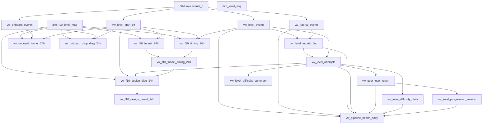

# Game Analytics Mart Documentation

Repository này lưu tài liệu kỹ thuật cho hệ thống phân tích dữ liệu gameplay của dự án mobile puzzle match-3.

Mục tiêu của repository là giúp team hiểu rõ:

* dữ liệu được lấy từ đâu;
* các bảng và view trong BigQuery được xây dựng như thế nào;
* từng object phục vụ mục đích phân tích gì;
* object nào phụ thuộc object nào;
* cách đọc kết quả phân tích onboarding, 10 level đầu, độ khó level, progression và sức khỏe pipeline.

Trong tài liệu này:

* **GA4** là Google Analytics 4, nguồn tracking sự kiện từ game.
* **BigQuery** là nơi lưu và truy vấn dữ liệu.
* **Dataset** là vùng chứa dữ liệu trong BigQuery.
* **View** là bảng ảo trong BigQuery, không lưu dữ liệu vật lý mà lưu logic truy vấn.
* **Mart** là lớp dữ liệu đã được xử lý để phục vụ phân tích.
* **Pipeline** là luồng xử lý dữ liệu từ nguồn thô đến bảng phân tích cuối.

---

## 1. Phạm vi repository

Repository này tập trung vào dataset:

```text
project-feb1f7ca-3dbf-419f-aa8.game_analytics_mart
```

Nguồn dữ liệu thô chính:

```text
project-feb1f7ca-3dbf-419f-aa8.analytics_524104373.events_*
```

Repository này không lưu dữ liệu raw, không lưu dữ liệu người dùng thật, không lưu credential và không lưu file private key.

Repository chỉ nên lưu:

* tài liệu đặc tả;
* DDL của bảng/view;
* sơ đồ phụ thuộc;
* quy ước phân tích;
* hướng dẫn kiểm tra dữ liệu;
* truy vấn mẫu phục vụ phân tích.

---

## 2. Trạng thái hiện tại

Data mart hiện có 20 object chính:

| Nhóm                      | Số lượng | Vai trò                                                           |
| ------------------------- | -------: | ----------------------------------------------------------------- |
| Core foundation           |        8 | Lớp nền: mapping, event sạch, tutorial flag, level attempts.      |
| Current live analysis     |        7 | Phân tích onboarding, first 10 level, timing, design diagnostics. |
| Monitoring level analysis |        5 | Theo dõi reach, difficulty, progression và pipeline health.       |

Tổng cộng:

```text
20 objects
```

---

## 3. Cấu trúc thư mục đề xuất

```text
.
├── README.md
├── docs/
│   ├── pipeline/
│   │   └── framework_pipeline.md
│   │
│   ├── graph/
│   │   └── mart_dependency_graph.md
│   │
│   └── objects/
│       ├── core_foundation/
│       │   ├── dim_f10_level_map.md
│       │   ├── dim_level_seq.md
│       │   ├── vw_level_start_eff.md
│       │   ├── vw_onboard_events.md
│       │   ├── vw_level_events.md
│       │   ├── vw_tutorial_events.md
│       │   ├── vw_level_tutorial_flag.md
│       │   └── vw_level_attempts.md
│       │
│       ├── current_live_analysis/
│       │   ├── vw_onboard_funnel_24h.md
│       │   ├── vw_onboard_drop_diag_24h.md
│       │   ├── vw_f10_funnel_24h.md
│       │   ├── vw_f10_timing_24h.md
│       │   ├── vw_f10_funnel_timing_24h.md
│       │   ├── vw_f10_design_diag_24h.md
│       │   └── vw_f10_design_board_24h.md
│       │
│       └── monitoring_level_analysis/
│           ├── vw_user_level_reach.md
│           ├── vw_level_difficulty_daily.md
│           ├── vw_level_difficulty_summary.md
│           ├── vw_level_progression_version.md
│           └── vw_pipeline_health_daily.md
│
└── sql/
    └── ddl/
        ├── core_foundation/
        ├── current_live_analysis/
        └── monitoring_level_analysis/
```

---

## 4. Danh sách object

### 4.1 Core foundation

| Object                   | Loại  | Mục đích                                                       |
| ------------------------ | ----- | -------------------------------------------------------------- |
| `dim_f10_level_map`      | Table | Mapping 10 level đầu theo app version.                         |
| `dim_level_seq`          | Table | Mapping sequence tổng quát của normal level.                   |
| `vw_level_start_eff`     | View  | Chuẩn hóa effective level start, bao gồm pseudo start khi cần. |
| `vw_onboard_events`      | View  | Làm sạch event onboarding.                                     |
| `vw_level_events`        | View  | Làm sạch `Start_level` và `End_level`.                         |
| `vw_tutorial_events`     | View  | Làm sạch tutorial events.                                      |
| `vw_level_tutorial_flag` | View  | Gắn cờ `Start_level` có gần tutorial hay không.                |
| `vw_level_attempts`      | View  | Ghép `Start_level` với `End_level` thành level attempt.        |

---

### 4.2 Current live analysis

| Object                     | Loại | Mục đích                                    |
| -------------------------- | ---- | ------------------------------------------- |
| `vw_onboard_funnel_24h`    | View | Phân tích onboarding funnel trong 24 giờ.   |
| `vw_onboard_drop_diag_24h` | View | Chẩn đoán điểm rơi onboarding.              |
| `vw_f10_funnel_24h`        | View | Phân tích funnel 10 level đầu trong 24 giờ. |
| `vw_f10_timing_24h`        | View | Phân tích thời gian đi qua 10 level đầu.    |
| `vw_f10_funnel_timing_24h` | View | Kết hợp funnel và timing của 10 level đầu.  |
| `vw_f10_design_diag_24h`   | View | Chẩn đoán thiết kế 10 level đầu.            |
| `vw_f10_design_board_24h`  | View | Bảng ưu tiên hành động cho thiết kế level.  |

---

### 4.3 Monitoring level analysis

| Object                         | Loại | Mục đích                                               |
| ------------------------------ | ---- | ------------------------------------------------------ |
| `vw_user_level_reach`          | View | Tổng hợp trạng thái người chơi theo từng normal level. |
| `vw_level_difficulty_daily`    | View | Theo dõi độ khó level theo ngày.                       |
| `vw_level_difficulty_summary`  | View | Tổng hợp độ khó level trên toàn bộ dữ liệu.            |
| `vw_level_progression_version` | View | Phân tích progression theo app version.                |
| `vw_pipeline_health_daily`     | View | Kiểm tra sức khỏe kỹ thuật của pipeline hằng ngày.     |

---

## 5. Sơ đồ phụ thuộc tổng quát



---

## 6. Thứ tự đọc tài liệu khuyến nghị

Nếu đọc lần đầu, nên theo thứ tự sau:

1. `docs/pipeline/framework_pipeline.md`
2. `docs/graph/mart_dependency_graph.md`
3. `docs/objects/core_foundation/dim_f10_level_map.md`
4. `docs/objects/core_foundation/dim_level_seq.md`
5. `docs/objects/core_foundation/vw_level_start_eff.md`
6. `docs/objects/core_foundation/vw_onboard_events.md`
7. `docs/objects/core_foundation/vw_level_events.md`
8. `docs/objects/core_foundation/vw_tutorial_events.md`
9. `docs/objects/core_foundation/vw_level_tutorial_flag.md`
10. `docs/objects/core_foundation/vw_level_attempts.md`
11. Các view trong `current_live_analysis`
12. Các view trong `monitoring_level_analysis`

---

## 7. Quy ước đặt tên

### 7.1 Prefix object

| Prefix  | Ý nghĩa                                                |
| ------- | ------------------------------------------------------ |
| `dim_`  | Bảng dimension hoặc mapping.                           |
| `vw_`   | View trong BigQuery.                                   |
| `mart_` | Bảng vật lý phục vụ phân tích, nếu có trong tương lai. |

---

### 7.2 Viết tắt chuẩn

| Viết tắt  | Ý nghĩa                           |
| --------- | --------------------------------- |
| `f10`     | First 10 level.                   |
| `onboard` | Onboarding.                       |
| `diag`    | Diagnostics, tức chẩn đoán.       |
| `seq`     | Sequence, tức chuỗi thứ tự level. |

---

### 7.3 Hậu tố thời gian

| Hậu tố     | Ý nghĩa                                         |
| ---------- | ----------------------------------------------- |
| `_24h`     | Chỉ số trong vòng 24 giờ.                       |
| `_daily`   | Tổng hợp theo ngày.                             |
| `_summary` | Tổng hợp toàn bộ dữ liệu hoặc tổng hợp cấp cao. |

---

## 8. Quy ước tài liệu object spec

Mỗi file đặc tả object nên có cấu trúc sau:

```text
# <object_name>

## 1. Mục đích
## 2. Vai trò trong hệ thống
## 3. Câu hỏi phân tích có thể trả lời
## 4. Độ chi tiết của mỗi dòng dữ liệu
## 5. Loại đối tượng
## 6. Nguồn dữ liệu phụ thuộc
## 7. Danh sách cột
## 8. Logic xử lý chính
## 9. Kiểm tra chất lượng dữ liệu khuyến nghị
## 10. Cách sử dụng khuyến nghị
## 11. Lưu ý khi sử dụng
## 12. Rủi ro nếu view sai logic
## 13. Mức độ quan trọng
## 14. DDL tham chiếu
## Liên kết liên quan
```

Mục `## Liên kết liên quan` nên được thêm vào cuối mỗi file để hỗ trợ backlink và graph view.

---

## 9. Các nhóm phân tích chính

### 9.1 Onboarding

Các view liên quan:

* `vw_onboard_funnel_24h`
* `vw_onboard_drop_diag_24h`

Mục tiêu:

* đo người chơi có đi từ `first_open` đến `Open_first`, `Vuot_home`, Level 1 hay không;
* chẩn đoán điểm rơi trong 24 giờ đầu.

---

### 9.2 First 10 levels

Các view liên quan:

* `vw_f10_funnel_24h`
* `vw_f10_timing_24h`
* `vw_f10_funnel_timing_24h`
* `vw_f10_design_diag_24h`
* `vw_f10_design_board_24h`

Mục tiêu:

* đo phễu 10 level đầu;
* đo thời gian đi qua từng level;
* phát hiện level có rủi ro thiết kế;
* tạo bảng ưu tiên hành động.

---

### 9.3 Level difficulty

Các view liên quan:

* `vw_level_difficulty_daily`
* `vw_level_difficulty_summary`

Mục tiêu:

* theo dõi win rate, fail rate, duration và move usage;
* phân loại level theo độ khó;
* tách tracking risk khỏi difficulty risk.

---

### 9.4 Level progression

Các view liên quan:

* `vw_user_level_reach`
* `vw_level_progression_version`

Mục tiêu:

* đo người chơi đã tới và thắng từng normal level;
* đo tỷ lệ đi từ level hiện tại sang level kế tiếp;
* đo rơi sau khi thắng;
* theo dõi theo app version.

---

### 9.5 Pipeline health

View liên quan:

* `vw_pipeline_health_daily`

Mục tiêu:

* kiểm tra event bị thiếu;
* kiểm tra app version bị thiếu;
* kiểm tra tham số bắt buộc;
* kiểm tra attempt matching;
* kiểm tra progression mart;
* cảnh báo lỗi kỹ thuật theo ngày.

---

## 10. Một số lưu ý quan trọng

### 10.1 Không dùng mọi view cho cùng một mục đích

Ví dụ:

* muốn phân tích từng attempt, dùng `vw_level_attempts`;
* muốn phân tích từng user theo level, dùng `vw_user_level_reach`;
* muốn phân tích funnel 10 level đầu, dùng `vw_f10_funnel_24h`;
* muốn xem bảng ưu tiên design, dùng `vw_f10_design_board_24h`;
* muốn kiểm tra lỗi tracking, dùng `vw_pipeline_health_daily`.

---

### 10.2 Phân biệt raw start và effective start

Một số view dùng `vw_level_start_eff`, tức là effective level start.

Một số view dùng `vw_level_attempts`, tức là dữ liệu bắt đầu level đã ghép attempt.

Cần phân biệt hai nguồn này khi so sánh số liệu.

---

### 10.3 Không kết luận difficulty khi tracking chưa ổn

Nếu `matched_end_rate` thấp, cần kiểm tra tracking trước khi kết luận level khó hay dễ.

---

### 10.4 Các view 24 giờ chỉ nên đọc trên cohort đã đủ 24 giờ

Các view có hậu tố `_24h` thường dùng cửa sổ 24 giờ kể từ mốc bắt đầu.

Không nên so sánh người chơi chưa đủ thời gian quan sát với người chơi đã đủ thời gian.

---

## 11. Quy trình bảo trì tài liệu

Khi thay đổi một object trong BigQuery:

1. Cập nhật DDL trong thư mục `sql/ddl/`.
2. Cập nhật object spec tương ứng trong `docs/objects/`.
3. Cập nhật `docs/graph/mart_dependency_graph.md` nếu dependency thay đổi.
4. Kiểm tra lại mục `## Liên kết liên quan` ở các spec liên quan.
5. Ghi rõ thay đổi nếu logic phân tích hoặc định nghĩa metric thay đổi.

---

## 12. Không đưa vào repository

Không đưa các nội dung sau vào repository:

* private key;
* credential;
* raw export chứa dữ liệu người dùng;
* file chứa email, số điện thoại, hoặc thông tin cá nhân;
* dữ liệu đầy đủ từ GA4;
* token truy cập;
* thông tin nội bộ không cần thiết cho phân tích.

---

## 13. Trạng thái tài liệu

Hiện tại đã có đặc tả cho:

```text
20 / 20 objects
```

Đã có thêm:

```text
Framework Pipeline
Mart Dependency Graph
Backlink sections cho từng object spec
```

Repository này có thể tiếp tục mở rộng thêm:

* dashboard spec;
* metric dictionary;
* data quality checklist;
* release note theo app version;
* changelog thay đổi SQL;
* naming convention chi tiết hơn;
* test query cho từng view.
