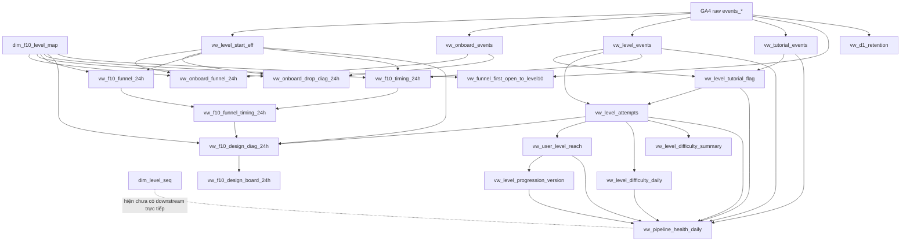

# Mart Dependency Graph

File này mô tả liên kết giữa các đặc tả trong `game_analytics_mart`.

Mục đích:

* tạo graph view cho toàn bộ data mart;
* cho biết object nào phụ thuộc object nào;
* giúp đọc tài liệu theo đúng thứ tự;
* giúp kiểm tra tác động khi sửa một view hoặc bảng;
* giúp phân biệt các view foundation, analysis, monitoring và retention.

Tổng số object hiện tại trong mart:

```text
22 objects
```

## 1. Tài liệu tổng quan

* [Framework Pipeline](../pipeline/framework_pipeline.md)
* [README](../../README.md)

## 2. Mermaid dependency graph



## 3. Link map theo object

| Object spec | Upstream | Downstream |
| --- | --- | --- |
| [dim_f10_level_map](../objects/core_foundation/dim_f10_level_map.md) | Không có upstream nội bộ | [vw_onboard_funnel_24h](../objects/current_live_analysis/vw_onboard_funnel_24h.md), [vw_onboard_drop_diag_24h](../objects/current_live_analysis/vw_onboard_drop_diag_24h.md), [vw_f10_funnel_24h](../objects/current_live_analysis/vw_f10_funnel_24h.md), [vw_f10_timing_24h](../objects/current_live_analysis/vw_f10_timing_24h.md), [vw_f10_design_diag_24h](../objects/current_live_analysis/vw_f10_design_diag_24h.md), [vw_funnel_first_open_to_level10](../objects/current_live_analysis/vw_funnel_first_open_to_level10.md) |
| [dim_level_seq](../objects/core_foundation/dim_level_seq.md) | Không có upstream nội bộ | Hiện chưa có downstream trực tiếp trong mart |
| [vw_level_start_eff](../objects/core_foundation/vw_level_start_eff.md) | GA4 raw `analytics_524104373.events_*` | [vw_onboard_funnel_24h](../objects/current_live_analysis/vw_onboard_funnel_24h.md), [vw_onboard_drop_diag_24h](../objects/current_live_analysis/vw_onboard_drop_diag_24h.md), [vw_f10_funnel_24h](../objects/current_live_analysis/vw_f10_funnel_24h.md), [vw_f10_timing_24h](../objects/current_live_analysis/vw_f10_timing_24h.md), [vw_f10_design_diag_24h](../objects/current_live_analysis/vw_f10_design_diag_24h.md) |
| [vw_onboard_events](../objects/core_foundation/vw_onboard_events.md) | GA4 raw `analytics_524104373.events_*` | [vw_onboard_funnel_24h](../objects/current_live_analysis/vw_onboard_funnel_24h.md), [vw_onboard_drop_diag_24h](../objects/current_live_analysis/vw_onboard_drop_diag_24h.md) |
| [vw_level_events](../objects/core_foundation/vw_level_events.md) | GA4 raw `analytics_524104373.events_*` | [vw_level_tutorial_flag](../objects/core_foundation/vw_level_tutorial_flag.md), [vw_level_attempts](../objects/core_foundation/vw_level_attempts.md), [vw_f10_timing_24h](../objects/current_live_analysis/vw_f10_timing_24h.md), [vw_pipeline_health_daily](../objects/monitoring_level_analysis/vw_pipeline_health_daily.md) |
| [vw_tutorial_events](../objects/core_foundation/vw_tutorial_events.md) | GA4 raw `analytics_524104373.events_*` | [vw_level_tutorial_flag](../objects/core_foundation/vw_level_tutorial_flag.md), [vw_pipeline_health_daily](../objects/monitoring_level_analysis/vw_pipeline_health_daily.md) |
| [vw_level_tutorial_flag](../objects/core_foundation/vw_level_tutorial_flag.md) | [vw_level_events](../objects/core_foundation/vw_level_events.md), [vw_tutorial_events](../objects/core_foundation/vw_tutorial_events.md) | [vw_level_attempts](../objects/core_foundation/vw_level_attempts.md), [vw_pipeline_health_daily](../objects/monitoring_level_analysis/vw_pipeline_health_daily.md) |
| [vw_level_attempts](../objects/core_foundation/vw_level_attempts.md) | [vw_level_tutorial_flag](../objects/core_foundation/vw_level_tutorial_flag.md), [vw_level_events](../objects/core_foundation/vw_level_events.md) | [vw_f10_design_diag_24h](../objects/current_live_analysis/vw_f10_design_diag_24h.md), [vw_user_level_reach](../objects/monitoring_level_analysis/vw_user_level_reach.md), [vw_level_difficulty_daily](../objects/monitoring_level_analysis/vw_level_difficulty_daily.md), [vw_level_difficulty_summary](../objects/monitoring_level_analysis/vw_level_difficulty_summary.md), [vw_pipeline_health_daily](../objects/monitoring_level_analysis/vw_pipeline_health_daily.md) |
| [vw_onboard_funnel_24h](../objects/current_live_analysis/vw_onboard_funnel_24h.md) | [dim_f10_level_map](../objects/core_foundation/dim_f10_level_map.md), [vw_onboard_events](../objects/core_foundation/vw_onboard_events.md), [vw_level_start_eff](../objects/core_foundation/vw_level_start_eff.md) | Không có downstream trực tiếp |
| [vw_onboard_drop_diag_24h](../objects/current_live_analysis/vw_onboard_drop_diag_24h.md) | [dim_f10_level_map](../objects/core_foundation/dim_f10_level_map.md), [vw_onboard_events](../objects/core_foundation/vw_onboard_events.md), [vw_level_start_eff](../objects/core_foundation/vw_level_start_eff.md) | Không có downstream trực tiếp |
| [vw_f10_funnel_24h](../objects/current_live_analysis/vw_f10_funnel_24h.md) | [dim_f10_level_map](../objects/core_foundation/dim_f10_level_map.md), [vw_level_start_eff](../objects/core_foundation/vw_level_start_eff.md) | [vw_f10_funnel_timing_24h](../objects/current_live_analysis/vw_f10_funnel_timing_24h.md) |
| [vw_f10_timing_24h](../objects/current_live_analysis/vw_f10_timing_24h.md) | [dim_f10_level_map](../objects/core_foundation/dim_f10_level_map.md), [vw_level_start_eff](../objects/core_foundation/vw_level_start_eff.md), [vw_level_events](../objects/core_foundation/vw_level_events.md) | [vw_f10_funnel_timing_24h](../objects/current_live_analysis/vw_f10_funnel_timing_24h.md) |
| [vw_f10_funnel_timing_24h](../objects/current_live_analysis/vw_f10_funnel_timing_24h.md) | [vw_f10_funnel_24h](../objects/current_live_analysis/vw_f10_funnel_24h.md), [vw_f10_timing_24h](../objects/current_live_analysis/vw_f10_timing_24h.md) | [vw_f10_design_diag_24h](../objects/current_live_analysis/vw_f10_design_diag_24h.md) |
| [vw_f10_design_diag_24h](../objects/current_live_analysis/vw_f10_design_diag_24h.md) | [dim_f10_level_map](../objects/core_foundation/dim_f10_level_map.md), [vw_level_start_eff](../objects/core_foundation/vw_level_start_eff.md), [vw_level_attempts](../objects/core_foundation/vw_level_attempts.md), [vw_f10_funnel_timing_24h](../objects/current_live_analysis/vw_f10_funnel_timing_24h.md) | [vw_f10_design_board_24h](../objects/current_live_analysis/vw_f10_design_board_24h.md) |
| [vw_f10_design_board_24h](../objects/current_live_analysis/vw_f10_design_board_24h.md) | [vw_f10_design_diag_24h](../objects/current_live_analysis/vw_f10_design_diag_24h.md) | Không có downstream trực tiếp |
| [vw_funnel_first_open_to_level10](../objects/current_live_analysis/vw_funnel_first_open_to_level10.md) | GA4 raw `analytics_524104373.events_*`, [dim_f10_level_map](../objects/core_foundation/dim_f10_level_map.md) | Không có downstream trực tiếp |
| [vw_user_level_reach](../objects/monitoring_level_analysis/vw_user_level_reach.md) | [vw_level_attempts](../objects/core_foundation/vw_level_attempts.md) | [vw_level_progression_version](../objects/monitoring_level_analysis/vw_level_progression_version.md), [vw_pipeline_health_daily](../objects/monitoring_level_analysis/vw_pipeline_health_daily.md) |
| [vw_level_difficulty_daily](../objects/monitoring_level_analysis/vw_level_difficulty_daily.md) | [vw_level_attempts](../objects/core_foundation/vw_level_attempts.md) | [vw_pipeline_health_daily](../objects/monitoring_level_analysis/vw_pipeline_health_daily.md) |
| [vw_level_difficulty_summary](../objects/monitoring_level_analysis/vw_level_difficulty_summary.md) | [vw_level_attempts](../objects/core_foundation/vw_level_attempts.md) | Không có downstream trực tiếp |
| [vw_level_progression_version](../objects/monitoring_level_analysis/vw_level_progression_version.md) | [vw_user_level_reach](../objects/monitoring_level_analysis/vw_user_level_reach.md) | [vw_pipeline_health_daily](../objects/monitoring_level_analysis/vw_pipeline_health_daily.md) |
| [vw_pipeline_health_daily](../objects/monitoring_level_analysis/vw_pipeline_health_daily.md) | [vw_level_events](../objects/core_foundation/vw_level_events.md), [vw_tutorial_events](../objects/core_foundation/vw_tutorial_events.md), [vw_level_tutorial_flag](../objects/core_foundation/vw_level_tutorial_flag.md), [vw_level_attempts](../objects/core_foundation/vw_level_attempts.md), [vw_user_level_reach](../objects/monitoring_level_analysis/vw_user_level_reach.md), [vw_level_difficulty_daily](../objects/monitoring_level_analysis/vw_level_difficulty_daily.md), [vw_level_progression_version](../objects/monitoring_level_analysis/vw_level_progression_version.md) | Không có downstream trực tiếp |
| [vw_d1_retention](../objects/retention_analysis/vw_d1_retention.md) | GA4 raw `analytics_524104373.events_*` | Không có downstream trực tiếp |

## 4. Đọc graph theo tầng

### 4.1 Raw ingestion layer

Các view hoặc analysis object đọc trực tiếp từ GA4 raw events:

* [vw_level_start_eff](../objects/core_foundation/vw_level_start_eff.md)
* [vw_onboard_events](../objects/core_foundation/vw_onboard_events.md)
* [vw_level_events](../objects/core_foundation/vw_level_events.md)
* [vw_tutorial_events](../objects/core_foundation/vw_tutorial_events.md)
* [vw_funnel_first_open_to_level10](../objects/current_live_analysis/vw_funnel_first_open_to_level10.md)
* [vw_d1_retention](../objects/retention_analysis/vw_d1_retention.md)

Lưu ý:

* `vw_level_start_eff`, `vw_onboard_events`, `vw_level_events`, `vw_tutorial_events` là các view foundation đọc raw để chuẩn hóa dữ liệu.
* `vw_funnel_first_open_to_level10` và `vw_d1_retention` là analysis views nhưng vẫn đọc trực tiếp GA4 raw để phục vụ logic cohort, funnel và retention riêng.

### 4.2 Core foundation layer

Các object lõi:

* [dim_f10_level_map](../objects/core_foundation/dim_f10_level_map.md)
* [dim_level_seq](../objects/core_foundation/dim_level_seq.md)
* [vw_level_start_eff](../objects/core_foundation/vw_level_start_eff.md)
* [vw_onboard_events](../objects/core_foundation/vw_onboard_events.md)
* [vw_level_events](../objects/core_foundation/vw_level_events.md)
* [vw_tutorial_events](../objects/core_foundation/vw_tutorial_events.md)
* [vw_level_tutorial_flag](../objects/core_foundation/vw_level_tutorial_flag.md)
* [vw_level_attempts](../objects/core_foundation/vw_level_attempts.md)

### 4.3 Current live analysis layer

Các view phân tích hiện tại:

* [vw_onboard_funnel_24h](../objects/current_live_analysis/vw_onboard_funnel_24h.md)
* [vw_onboard_drop_diag_24h](../objects/current_live_analysis/vw_onboard_drop_diag_24h.md)
* [vw_f10_funnel_24h](../objects/current_live_analysis/vw_f10_funnel_24h.md)
* [vw_f10_timing_24h](../objects/current_live_analysis/vw_f10_timing_24h.md)
* [vw_f10_funnel_timing_24h](../objects/current_live_analysis/vw_f10_funnel_timing_24h.md)
* [vw_f10_design_diag_24h](../objects/current_live_analysis/vw_f10_design_diag_24h.md)
* [vw_f10_design_board_24h](../objects/current_live_analysis/vw_f10_design_board_24h.md)
* [vw_funnel_first_open_to_level10](../objects/current_live_analysis/vw_funnel_first_open_to_level10.md)

### 4.4 Monitoring and level analysis layer

Các view theo dõi và phân tích level:

* [vw_user_level_reach](../objects/monitoring_level_analysis/vw_user_level_reach.md)
* [vw_level_difficulty_daily](../objects/monitoring_level_analysis/vw_level_difficulty_daily.md)
* [vw_level_difficulty_summary](../objects/monitoring_level_analysis/vw_level_difficulty_summary.md)
* [vw_level_progression_version](../objects/monitoring_level_analysis/vw_level_progression_version.md)
* [vw_pipeline_health_daily](../objects/monitoring_level_analysis/vw_pipeline_health_daily.md)

### 4.5 Retention analysis layer

Các view phân tích retention:

* [vw_d1_retention](../objects/retention_analysis/vw_d1_retention.md)

## 5. Thứ tự đọc tài liệu khuyến nghị

Đọc theo thứ tự sau để hiểu pipeline từ gốc đến báo cáo:

1. [Framework Pipeline](../pipeline/framework_pipeline.md)
2. [dim_f10_level_map](../objects/core_foundation/dim_f10_level_map.md)
3. [dim_level_seq](../objects/core_foundation/dim_level_seq.md)
4. [vw_level_start_eff](../objects/core_foundation/vw_level_start_eff.md)
5. [vw_onboard_events](../objects/core_foundation/vw_onboard_events.md)
6. [vw_level_events](../objects/core_foundation/vw_level_events.md)
7. [vw_tutorial_events](../objects/core_foundation/vw_tutorial_events.md)
8. [vw_level_tutorial_flag](../objects/core_foundation/vw_level_tutorial_flag.md)
9. [vw_level_attempts](../objects/core_foundation/vw_level_attempts.md)
10. [vw_onboard_funnel_24h](../objects/current_live_analysis/vw_onboard_funnel_24h.md)
11. [vw_onboard_drop_diag_24h](../objects/current_live_analysis/vw_onboard_drop_diag_24h.md)
12. [vw_f10_funnel_24h](../objects/current_live_analysis/vw_f10_funnel_24h.md)
13. [vw_f10_timing_24h](../objects/current_live_analysis/vw_f10_timing_24h.md)
14. [vw_f10_funnel_timing_24h](../objects/current_live_analysis/vw_f10_funnel_timing_24h.md)
15. [vw_f10_design_diag_24h](../objects/current_live_analysis/vw_f10_design_diag_24h.md)
16. [vw_f10_design_board_24h](../objects/current_live_analysis/vw_f10_design_board_24h.md)
17. [vw_funnel_first_open_to_level10](../objects/current_live_analysis/vw_funnel_first_open_to_level10.md)
18. [vw_d1_retention](../objects/retention_analysis/vw_d1_retention.md)
19. [vw_user_level_reach](../objects/monitoring_level_analysis/vw_user_level_reach.md)
20. [vw_level_difficulty_daily](../objects/monitoring_level_analysis/vw_level_difficulty_daily.md)
21. [vw_level_difficulty_summary](../objects/monitoring_level_analysis/vw_level_difficulty_summary.md)
22. [vw_level_progression_version](../objects/monitoring_level_analysis/vw_level_progression_version.md)
23. [vw_pipeline_health_daily](../objects/monitoring_level_analysis/vw_pipeline_health_daily.md)

## 6. Quy ước backlink trong từng spec

Để graph view hiển thị rõ hơn, nên thêm mục sau vào cuối mỗi file object spec:

```markdown
## Liên kết liên quan

- Framework: [Framework Pipeline](../../pipeline/framework_pipeline.md)
- Upstream:
  - ...
- Downstream:
  - ...
```

Với các file trong thư mục:

```text
docs/objects/core_foundation/
docs/objects/current_live_analysis/
docs/objects/monitoring_level_analysis/
docs/objects/retention_analysis/
```

đường dẫn về framework nên dùng:

```text
../../pipeline/framework_pipeline.md
```

Còn đường dẫn giữa các object spec nên dùng:

```text
../core_foundation/<object>.md
../current_live_analysis/<object>.md
../monitoring_level_analysis/<object>.md
../retention_analysis/<object>.md
```

## 7. Ghi chú

* Graph hiện tại mô tả 22 objects trong `game_analytics_mart`.
* `dim_level_seq` hiện chưa có downstream trực tiếp trong dependency graph hiện tại.
* `vw_level_difficulty_summary` hiện chưa có downstream trực tiếp.
* `vw_pipeline_health_daily` là node cuối của nhánh monitoring.
* `vw_f10_design_board_24h` là node cuối của nhánh design action board.
* `vw_funnel_first_open_to_level10` là analysis view đọc trực tiếp từ GA4 raw và `dim_f10_level_map`, không đi qua các foundation view như `vw_level_start_eff` hoặc `vw_level_attempts`.
* `vw_d1_retention` là retention analysis view đọc trực tiếp từ GA4 raw, không có upstream nội bộ trong mart.
* Các view đọc trực tiếp từ GA4 raw nên được xem là điểm nhạy cảm của pipeline dữ liệu. Nếu event name, event param, app version logic hoặc GA4 export behavior thay đổi, cần kiểm tra lại các view này trước khi kết luận về funnel, retention hoặc difficulty.
* Nếu sau này `vw_pipeline_health_daily` được mở rộng để kiểm tra `vw_funnel_first_open_to_level10` hoặc `vw_d1_retention`, cần cập nhật lại dependency graph và link map tương ứng.
